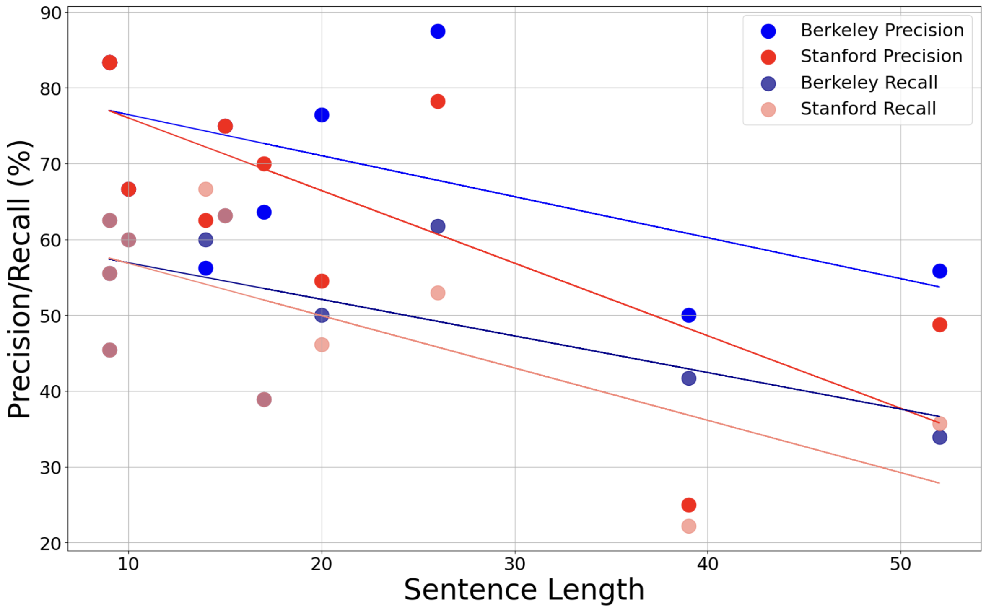

# Comparative Analysis of Constituency Parsers: A Case Study on Stanford U-PCFG and Berkeley Neural Parsers

## Abstract
Constituency parser performance is typically evaluated with bracketing F-score, which is a useful proxy of overall performance but does not adequately reveal the strengths and weaknesses of a system. This report presents quantitative and qualitative evaluations that aim to capture the behavior of a parser under different scenarios through observations of parser performance on a designated test set.1 To that end, it offers a comparative analysis of two constituency parsers: Berkeley Neural Parser (Kitaev and Klein, 2018; Kitaev et al., 2019) and Stanford Unlexicalized Probabilistic Context-Free Grammar (PCFG) Parser (Klein and Manning, 2003)

# Results
## Precision and Recall

## Parsing Time

## Error Types

## Example: Stanford PCFG Parser Mistakes

## Example: Berkeley Neural Parser Mistakes

